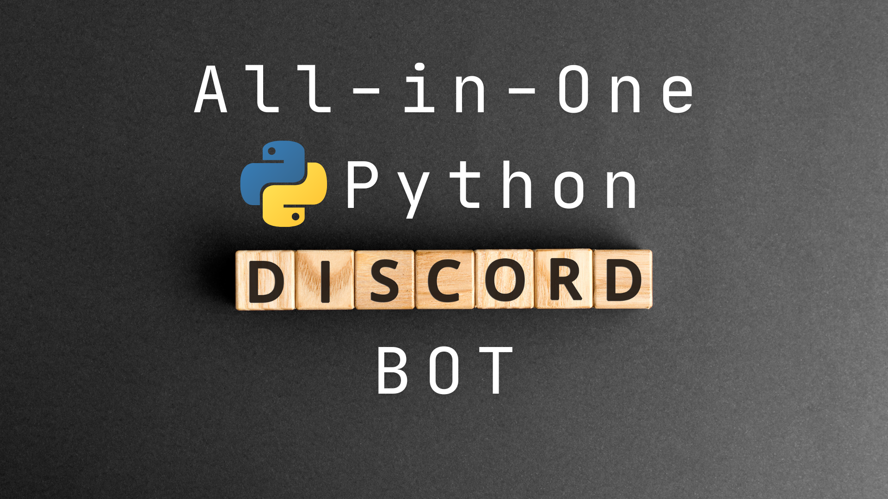

# All-in-One-Discord-Python-BOT



Welcome to the **All-in-One-Discord-Python-BOT** repository! This project features a versatile Discord bot built with Python, using `discord.py` and `Quart` for asynchronous operations, and integrates with `Google Gemini` and `ChatGPT` for advanced functionalities. `MongoDB` is used for data storage.


## Features

- **Multi-Platform Support**: Includes `start.sh` for Unix-based systems (Linux, macOS) and `start.bat` for Windows.
- **Secure Configuration**: Utilizes `.env` files for storing API keys and other sensitive data.
- **Advanced Integrations**: Combines Google Gemini and ChatGPT for enhanced conversational capabilities.

## Getting Started

### Prerequisites

1. **Python 3.8+**: Ensure you have Python 3.8 or higher installed.
2. **MongoDB**: Make sure you have a MongoDB instance running.

### Setup

1. **Clone the Repository**
```bash
git clone https://github.com/AvishakeAdhikary/All-in-One-Discord-Python-BOT.git
cd All-in-One-Discord-Python-BOT
```
2. **Install Dependencies:**\
Install the required packages:
```bash
pip install -r requirements.txt
```
3. **Configure Environment Variables**\
Copy the example `.env` file to create your own `.env` file:
```bash
cp .env.example .env
```
Open the `.env` file and replace the placeholder values with your actual API keys and configuration details.
4. **Database Setup**
Ensure MongoDB is running and properly configured in your `.env` file.

## Running the Bot
To start the bot, use the appropriate script based on your operating system:\
Unix-based Systems (Linux, macOS):
```bash
./start.sh
```
Windows:
```bash
start.bat
```
## Contributing
Contributions are welcome! Please fork the repository and submit a pull request with your changes.
1. Fork the repository.
2. Create a new branch (`git checkout -b feature/your-feature`).
3. Make your changes.
4. Commit your changes (`git commit -am 'Add some feature'`).
5. Push to the branch (`git push origin feature/your-feature`).
6. Create a new Pull Request.

### License

This project is licensed under the MIT License. See the [LICENSE](LICENSE) file for details.

### Contact
For any questions or issues, please open an issue on the GitHub repository or contact the repository maintainer at [avhishe.adhikary11@gmail.com](mailto:avhishe.adhikary11@gmail.com) or [brodiscordbot@hotmail.com](mailto:brodiscordbot@hotmail.com).
<!-- BroBot@2024 -->